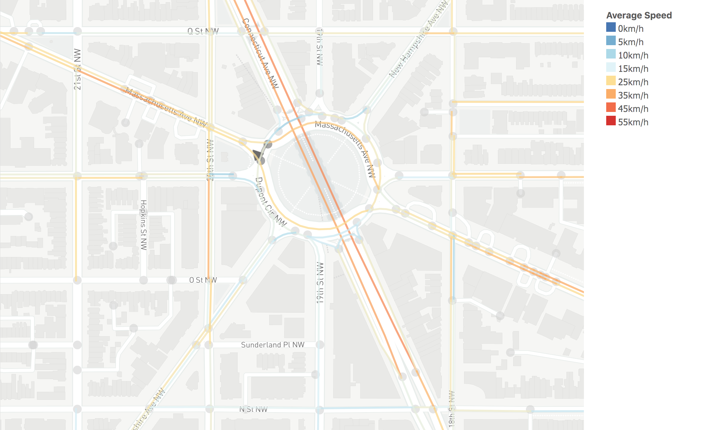
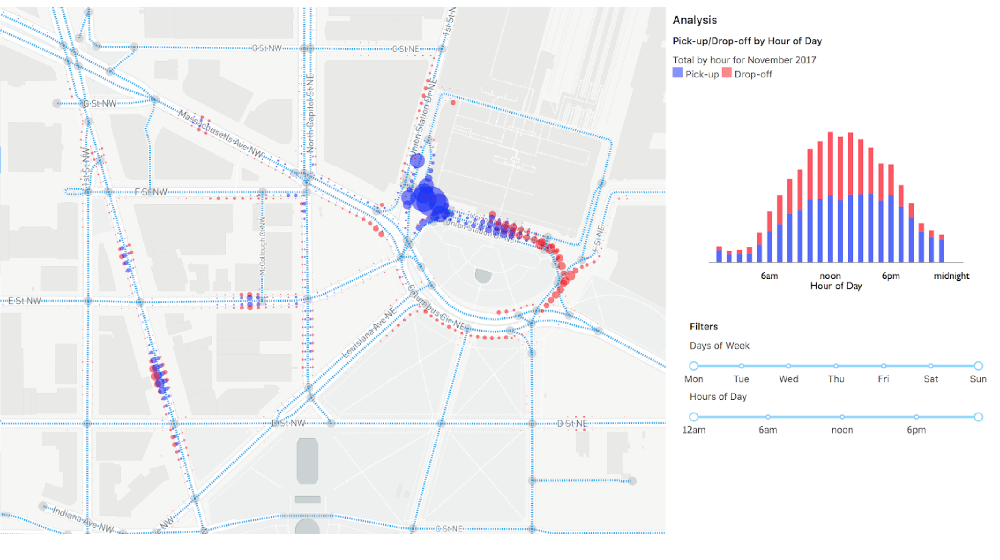
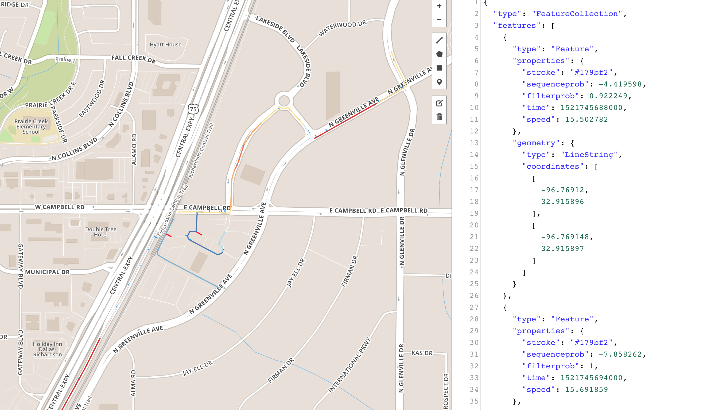
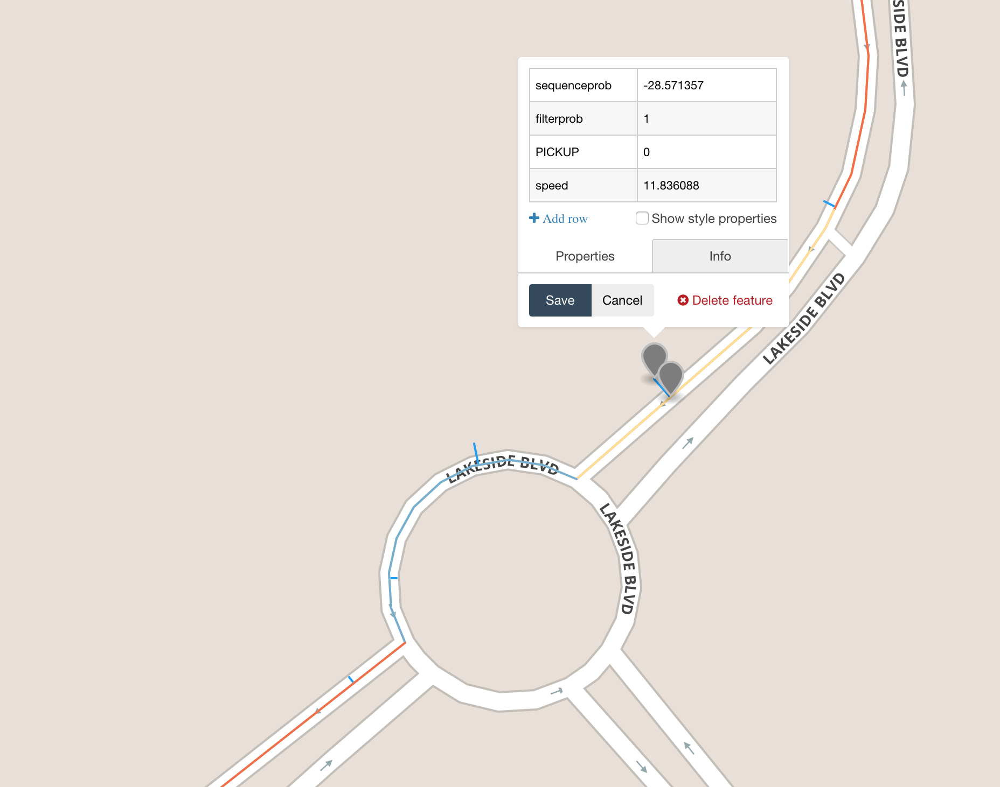
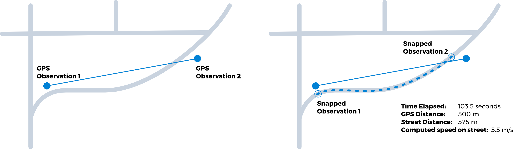
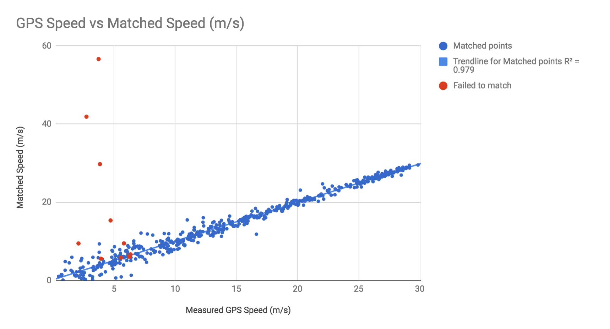

# SharedStreets Matcher

A tool for converting GPS traces into traffic speed and location observations linked to SharedStreets. 



#### Concept

SharedStreets uses map-matched GPS points to generate data on roadway traffic speeds, and to aggregate events along streets (e.g. pick-ups/drop-offs, hard braking, etc.). Data points are snapped to the roadway network, recording the location along a given street and the direction of travel.  

Data about events are snapped to specific locations along the roadway and aggregated using SharedStreets' binned linear referencing system (see Data model below). The following image shows pick up and drop-off events grouped into 10-meter directional bins along street segments.




#### Quick start

Download the latest pre-built binaries from the[ Github Releases](https://github.com/sharedstreets/sharedstreets-matcher/releases) tab above

Prepare input data from GPX traces. Converts sample GPX traces to SharedStreets input file (`osm_gpx/event_data`) and generates a list of SharedStreets tiles needed to build map (`osm_gpx/tile_set.txt`).

```java -jar [path/to]/ingest-1.0.jar  --input sample_data/gpx --output osm_gpx/ --type gpx -speeds```

Download tile data -- caches map data tiles from SharedStreets global tile set (note xargs and wget milage may vary by version and OS)

```
cd osm_gpx
mkdir map_tiles
cd map_tiles

# MacOS
xargs -n 1 curl -O < ../tile_set.txt 

# Ubuntu 
wget -i ../tile_set.txt 

cd ../
```

Copy map matcher configuration to local directory

```
wget https://raw.githubusercontent.com/sharedstreets/sharedstreets-matcher/master/tracker.properties
```

Run map matching system

```
java -jar [path/to]/sharedstreets-matcher-1.0.jar --input ./event_data --map ./map_tiles --output  ./output_tiles  --debug  ./debug
```

Open debug trace files using [GeoJson.io](http://geojson.io/). Colored street edges show travel speed, and blue and red tick marks alone edges show GPS relationship to matched point along street edge. Red tick marks are "failed matches" due to GPS or map errors (image below shows red ticks caused by missing OSM edges).




#### Preparing GPS data

The SharedStreets Matcher imports GPS records containing:

*  vehicle id (string ID unique to data set)
*  timestamp ([ISO 8061](https://en.wikipedia.org/wiki/ISO_8601) date string or UNIX timestamp in milliseconds GMT)
*  latitude (WGS84 decimal degrees)
*  longitude (WGS84 decimal degrees)
*  event type (optional label for snapped events e.g. `PICKUP`)
*  event value (optional numeric value corresponding with event)

Before matching, GPS data needs to be imported and converted to the SharedStreets event input format. The ingest tool reads trace data from CSV, JSON, and GPX file formats and exports a normalized input data set for use by the matcher (`[output_dir]/event_data`). The ingest tool also identifies the map tiles needed to match against the input traces and generates a list of SharedStreets tile URLS (`[output_dir]/tile_set.txt`).

##### CSV data

Ingest tool imports CSV data using the format:

`[vehicle_id],[time],[lat],[lon],[optional_event_name],[optional_event_value]`.

A single CSV file can contain multiple interleaved traces, as long as each vehicle is uniquely identified within the file. The order of the records in the CSV file does not impact map matching, as records are sorted by time for each group of vehicle IDs.  

There are two example CSV files in the directory `sample_data/csv`.  The file `csv_trace1` contains a complete trace with GPS speed data in the optional event data columns. The file `csv_trace2` is the same trace but contains a "PICKUP" and "DROPOFF" event. These location events are included as points in the debug trace output (see image below).

Command to load CSV data:

```java -jar [path/to]/ingest-1.0.jar  --input sample_data/csv/csv_trace1.csv --output csv_gpx/ --type csv```




##### GPX data

The ingest application can import a directory of GPX files, with each file containing a single vehicle trace. Vehicle events can be flagged in the trace by using the waypoint tag: `<wpt name="[event_type]">...</wpt>`

Command to load GPX data: 

```java -jar [path/to]/ingest-1.0.jar  --input sample_data/gpx --output osm_gpx/ --type gpx -speeds```


### Build from source

Prebuilt jar files for the ingest and matching tool are available in the [Github Releases](https://github.com/sharedstreets/sharedstreets-matcher/releases) tab above. Building from source requires Gradle v 3.x and JDK 1.8+. 

Both jar files can be built using the command:

```gradle build allJars```


### How does it work?


The matcher uses a probabilistic (HMM) model to_track GPS points and find the most likely placement and route for each point. By finding likely routes between points ambiguous and imprecise GPS points can be snapped to specific road segments, indicating direction of travel and distance between points over the road network. 



The SharedStreets Matcher uses SharedStreets references and geometry data to build its internal map. All statistics generated by the matcher use the SharedStreets  reference IDs to describe roadway segments and direction of travel. 

The internal map matching engine is derived from [BMW's Barefoot map matching library.](https://github.com/bmwcarit/barefoot) The original library has been substantially modified to replace the original PosgreSQL loader and OpenStreetMap data model with a SharedStreets tile-based data model, and to improve performance of map matching internals.

### Speed Validation

SharedStreets Matcher can be validated using any GPS data source that measures roadway speeds or odometer distances. Keeping in mind instantaneous measures of vehicle speed will differ from average point-to-point speeds generated from map matching, speeds recorded by the GPS device are a useful starting point for validation of the map matching engine. Odometer data allow more precise comparison of matched traces against actual distance traveled.

Speed information contained in GPX trace data can be imported using the `-speeds` flag during the ingest step. Subsequent debug trace output from the matcher will show both the matched speed and the imported GPS speed. 
 
The Github repository contains several GPX traces from OpenStreetMap with speed data. The chart below shows measured GPS speeds from these traces against SharedStreets matched speeds. The points in red failed to match, based on default matcher settings, due to incorrect OpenStreetMap data and were automatically excluded from SharedStreets output data. ([Complete data set](https://docs.google.com/spreadsheets/d/11VG9GoAROP1gm-EM3M5V2iQCLM3ZsPgKcNC_q32Q8Jk/edit#gid=0))




### Map Validation

Map match failures are frequently the result of incorrect basemap data. Data about failed matches can be used to detect and fix errors in the underlying map.

When using the `--dust` option, the SharedStreets matcher tracks the location of map match failures and aggregates failure rates by street edge. This data is stored in ["dust" tiles](https://github.com/sharedstreets/sharedstreets-matcher/blob/master/proto/dust.proto) for use in downstream map data quality analysis. Additional details on map validation and dust data TK.


### Data model 
To both protect privacy and simplify analysis applications SharedStreets does not store individual events in output data sets. Instead SharedStreets uses a variety of spatial and temporal aggregation techniques that build on the SharedStreets referencing system.

##### Speeds

SharedStreets matcher uses histograms to store speed observations. This allows aggregation and calculation of statistics from distribution of speeds without storing individual observations. Data generated by matcher is stored in protocol buffer tiles using the [SharedStreets Speed data format](https://github.com/sharedstreets/sharedstreets-ref-system/blob/master/proto/speeds.proto).

```
   count
    4 |       *
    3 |     * *   * *
    2 |   * * * * * * *
    1 | * * * * * * * * * *
       ________________________
        0 1 2 3 4 5 6 7 8 9
             Speed (km/h)
```

Mean and variance can be calculated from distribution. Histograms with absolute counts can be added together to merge observations. Histograms can also be stored using scaled counts (0-100 default) to hide absolute observation counts

##### Linear References

SharedStreets uses a linear referencing data model to describe point and segment features along street references

```
   [ SharedStreets Ref ]
   =============*=======
                ^ point at distance: 75 along reference

   [ SharedStreets Ref ]
   ========*******======
           ^     ^ linear segment from distance 50 to 75 along SharedStreets reference
```
##### "Binned" Linear References

Event data along street edges are aggregated using a "binned" linear reference. Each street edge is divided into equal length bins containing event counts and sums of event values. The default bin length is 10 meters, and can be altered using the `--binSize [meters]` flag in the matcher application.

```
	Reference Length = 100m
	Number of bins = 5
   ====*====*====*====*====
     0    1    2    3    4   = bin position (20m/bin)
     4    8    0    2    0   = bin value (count of grouped linear features)
```


##### Dealing with time

SharedStreets uses a weekly cycle to track periodic trends (e.g. traffic speeds, pick-up/drop-off events). Data is currently aggregated into "hour of week" periods, with Monday midnight as "hour zero" and Sunday midnight as "hour 167." A complete set of statistics are kept for each time period. The periods are then aggregated as required by downstream analysis.

### Performance

The processing rate varies significantly based on input data (e.g. time interval between GPS samples, trace length, and map area), and matcher settings. However, processing rates of ~1500 GPS samples / second / CPU core are typical for SharedStreets input data in urban areas.

SharedStreets Matcher is built using Apache Flink, and auto scales to use all available processors. Flink applications can be deployed on a multi-node cluster for distributed processing. 


